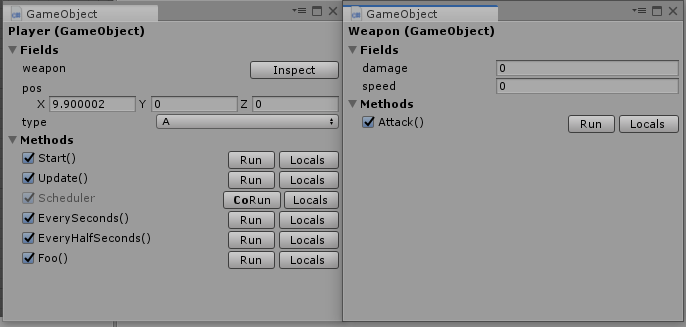

get_superinspector
====
This repository does not contains any kinds of source codes or executables. 
Only exists for documentation purpose.

Features
----
* Inspect __non-public__ variables.
* Inspect method's __local__ variables__
* Instant run 
* Enable/Disable method call

